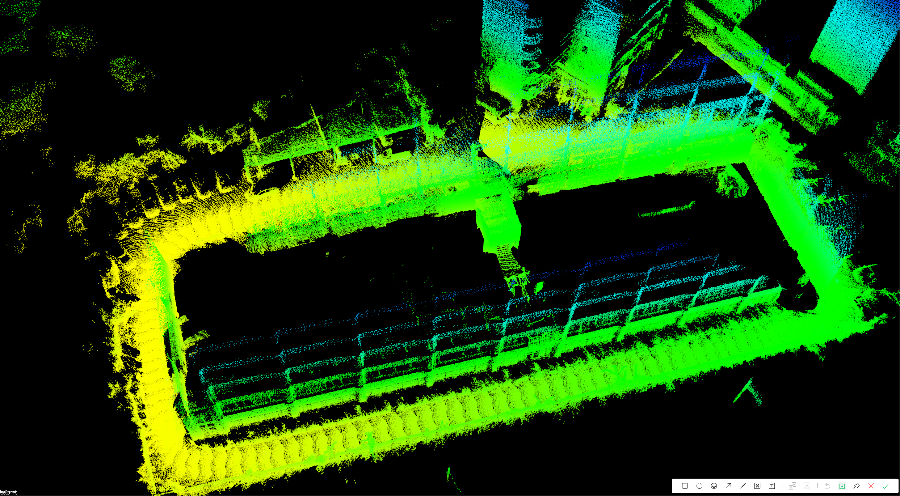

> 项目代码仓库地址（仅内部开发人员可见）: [单击此处跳转-项目地址](https://github.com/yzh317179958/Ebike_Human_Follower)

> 数据集链接：[单击此处跳转-百度网盘链接](https://pan.baidu.com/s/1UJ4aFU1e-reW9H4yikQusQ?pwd=data)
## 1.数据集介绍
**概述**
该数据集为面向电动自行车行人跟随系统的多模态道路场景数据集，专为复杂室外环境下的智能跟随算法研发而构建。数据集全面采集了毫米波雷达点云数据、高帧率相机视觉数据（包含RGB和深度信息）、高精度IMU惯性测量数据等多源传感器数据，并通过严格的时空同步标定确保多模态数据的对齐精度。数据场景涵盖典型城市道路环境中的多种工况：包括直线巡航、急缓弯道通过、闭合回环路径等常规场景，以及行人遮挡、群体穿越、突发障碍物干扰等挑战性场景。适用于自动驾驶、深度学习、多传感器融合等前沿算法的训练与测试。

## 2.数据采集设备

  

**雷达**

1.[型号](https://www.robosense.cn/IncrementalComponents/E1R):Robosense E1R

2.[驱动](https://github.com/RoboSense-LiDAR/rslidar_sdk):rslidar_SDK

3.[文档](https://robosense-wiki-cn.readthedocs.io/zh-cn/latest/):使用教程

速腾聚创面阵激光雷达E1R,输出话题为/rslidar_points，等效144线。点云格式为XYZI。

**IMU**

轮趣科技H30型号九轴IMU，输出话题为/imu/data_raw 实际六轴IMU就足够，不需要磁力计。

**相机**

1.[型号](https://www.orbbec.com.cn/index/Product/info.html?cate=38&id=62):Gemini 335L

2.[驱动](https://gitee.com/orbbecdeveloper/OrbbecSDK):Orbbec_SDK

3.[文档](https://www.orbbec.com.cn/index/Gemini330/info.html?cate=119&id=74):使用教程

## 3.数据集使用效果

### 3.1 里程计建图效果

  

该地图为飞道科技发展有限公司办公楼下场景。
